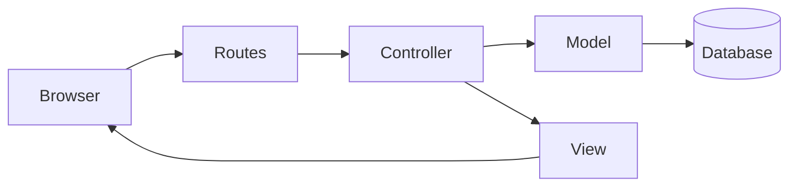
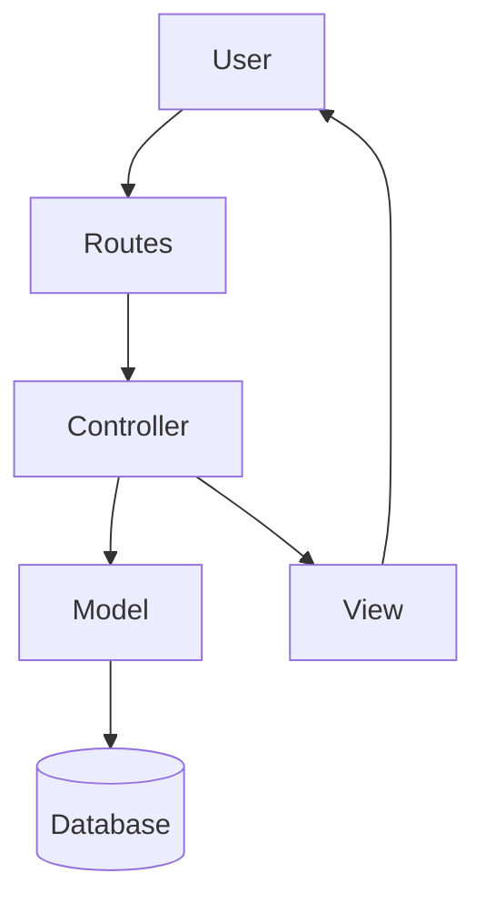
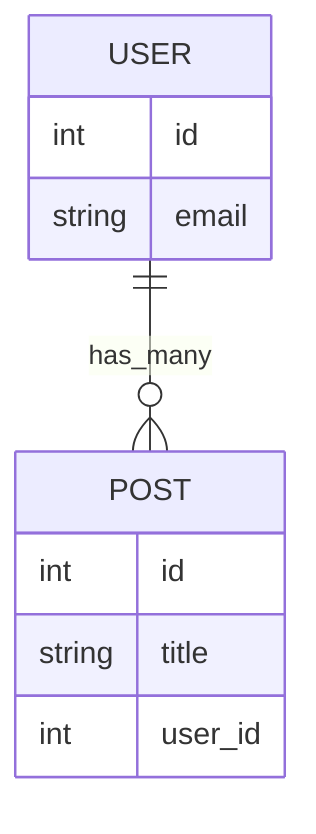

## Diagrams

This file contains architecture diagrams used in the learning material.

## MVC Architecture

```mermaid
flowchart LR
Browser --> Routes
Routes --> Controller
Controller --> Model
Model --> Database[(Database)]
Controller --> View
View --> Browser
```

## Rails Request Flow

```mermaid
flowchart TD
User --> Routes
Routes --> Controller
Controller --> Model
Model --> Database[(Database)]
Controller --> View
View --> User
```

## Database Relations

```mermaid
erDiagram
    USER ||--o{ POST : has_many

    USER {
        int id
        string email
    }

    POST {
        int id
        string title
        int user_id
    }
```

